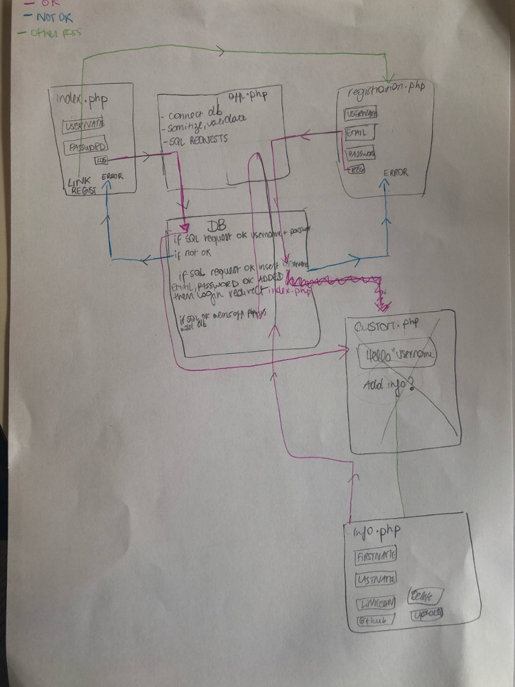
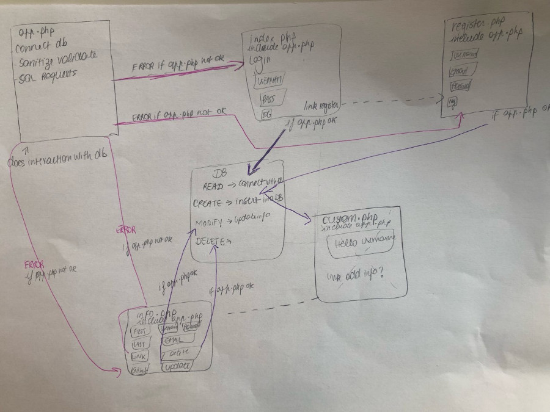

# logyourselfin
database creation and interaction  
You can see the result [here](https://logyourselfin.herokuapp.com/)

## Exercise which makes me play with a database.
This exercise makes me play with creating my own db. The aim is for me to 
- write SQL queries
- use a database manager
- make a create read update and delete system
- write a registration and login forms
- manage a login state

## Drawing mockup of the system

## Content
- a login page
    - the user arrives on the log in page
    - login options
        - if he has an account, he enter his username and password and arrives on the custom page
        - if its username or password don't match the database, an error is displayed
        - if he doesn't have an account, he can click on register and he is redirected to the registration page
- a registration page
    - there are inputs that the user needs to enter to register:
        - choose a username, email and password and clicks on register
        registration options
        - if the user enters incorrect inputs, an error is displayed
        - if the registration is going to plan the user is redirected to the custom page
- a custom page when the user is able to log in
    - this page will contain a hello "username"
    - button redirecting to info page  
- information page where user can update his informations and delete his account
    - fields with username, email, password, firstname, lastname, githublink, linkedin link
    - button delete account
        - if click on it, ask the user if hes sure if yes then delete from db
    - button update info

## Tools
- HTML, CSS, SASS
- Bootstrap
- PHP
- PHP myadmin
- terminal to manage the db

## Progression
- Login, logout, updating the username works
- Add displaying errors all pages
- Continue Update, Delete system
- When deployed some bugs arised.. related to the database?

## Credits
Made in Belgium
